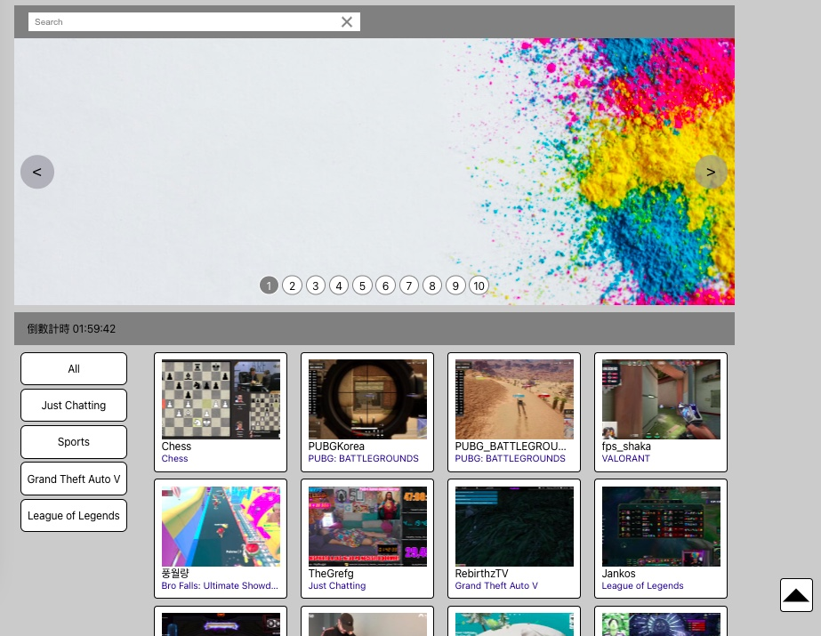

### Demo 網址：https://pcchen95.github.io/MRC_pretest/
完成畫面如下：

- 輪播圖圖檔資源來自：https://www.freepik.com
- API 串接以 Twitch API 為例
- 完成功能：
1. 輪播圖：共有 10 張圖片，可點選左/右按鈕切換上/下一張，或直接選擇編號切換。
2. 倒數計時器：預設設定倒數 2 小時。
3. 上方搜尋欄：以頻道名稱搜尋下方已列出的項目。
4. 項目清單：網頁載入後預設為不分種類列出前 30 個項目，點選可查看詳細內容。
5. 左方篩選鈕：這裡列出「全部」＋四種種類，點選以篩選項目。
6. 右方回最上方按鈕：點選可回到網頁最頂端。